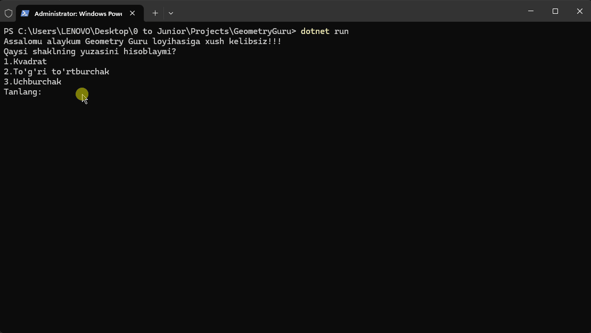

# GeometryGuru

C# tilida OOP ko'rinishida class va obyektlar yordamida yozilgan ushbu dastur foydalanuvchiga ko'plab geometrik shakllarning yuzasini hisoblashga yordam beradi
---
*Bizning ushbu dasturimizda 3 xil shaklning yuzalarini hisoblashingiz mumkun:*
1. Kvadrat
2. To'g'ri to'rtburchak
3. Uchburchak

**Dastur ishlash jarayoni:**

